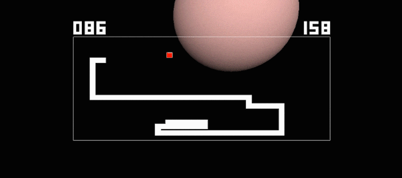
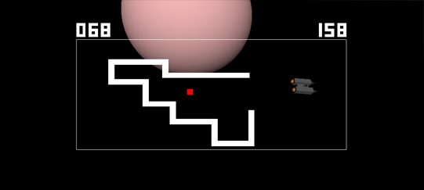
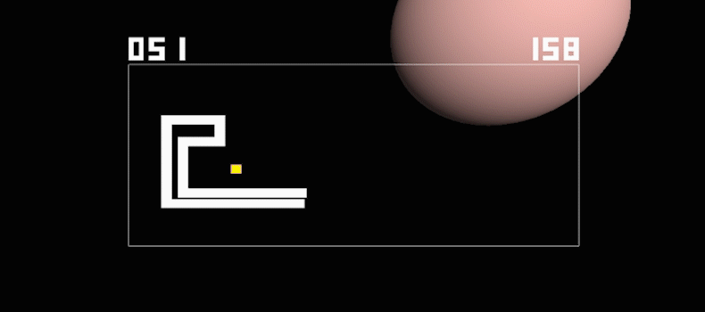

# **Space Snake**

Snake game with an interesting twist. WebGL JavaScript version featuring music by KAMI.

#### [Click here to play it in your browser:](http://sifuf.com/spaceSnake.html)


<div class="intro"><a href="http://sifuf.com/spaceSnake.html"></a></div>
</br>


For offline usage, simply clone the repo and open ```spaceSnake.html``` with any WebGL supported browser (Chrome, Firefox, etc.). No build required.
```
Control snake:
  Up/Down/Left/Right arrow keys

Start game:
  Enter key

Red food = 1 point
Yellow food = 10 points
```
**Try to beat the high score!**

<div class="intro"><a href="http://sifuf.com/spaceSnake.html"></a></div>
</br>

<div class="intro"><a href="http://sifuf.com/spaceSnake.html"></a></div>
</br>
